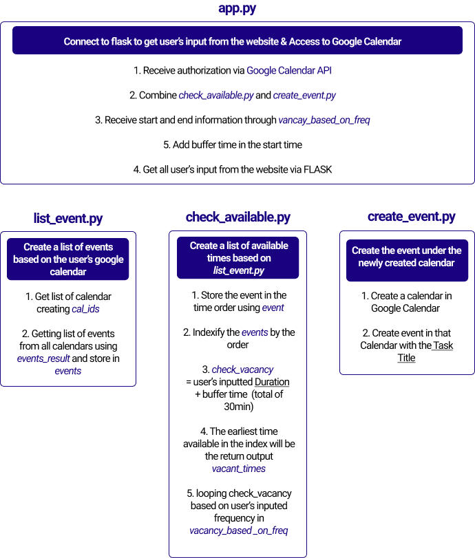

# Welcome to Fillup

## What is Fillup?

*Did you ever feel stressed organizing your calendar? Do you want your personal secretary to neatly arrange your day?*

Fillup, a scheduling automation application, eases the stress of the scheduling process. Users are asked to input the task’s title, duration, choice of morning or afternoon, and frequency a test per week. Based on this given criteria, the application will randomly select the available time block in the user's calendar. 

[Check our project proposal here](proposal.md)

## How Does It Work?

When you enter [*Fillup*](http://tryfillup.herokuapp.com/), you should start the application by clicking on the “Get Started” button. This will ask for the permission to give Fillup an authorization to your Google Calendar. After the authorization, you will be asked to fill in the title of a task, duration, time boundry, and frequency of a task per week. By clicking on the “Create” button, you will then receive a confirmation and choice to direct to Google Calendar. 

## Implementation Information 

## Results 

- Show off what it can do with video/screenshot + Graph on data 

## Project Evolution

We often encounter a struggle to find a time slot to perform a trivial but important task, such as exercising, stretching, reading books and calling parents. Working as a group, our team promised to individually spend half an hour once a week to work on the given task. However, we found ourselves making an excuse and complaining about our tight schedule. 

Contemplating such a common issue, our team decided to create an application that assists scheduling based on the available time in the user’s Google Calendar. 

## Attribution

Portions of this application are modifications based on work created and [shared by Google](https://developers.google.com/terms/site-policies) and used according to terms described in [the Creative Commons 4.0 Attribution License](https://creativecommons.org/licenses/by/4.0/). Also, the application is attributed to the [Stackabuse](https://stackabuse.com/deploying-a-flask-application-to-heroku/).

